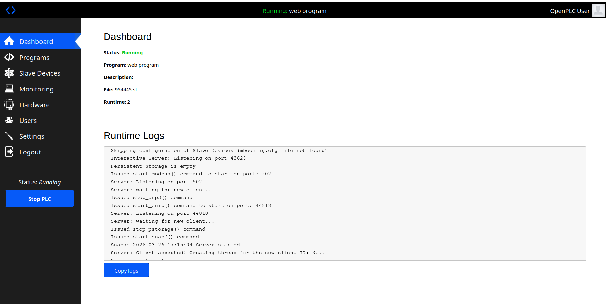
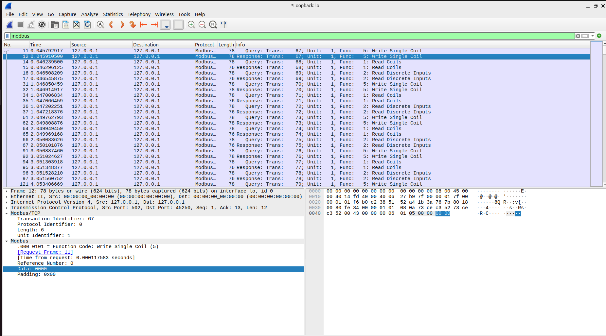
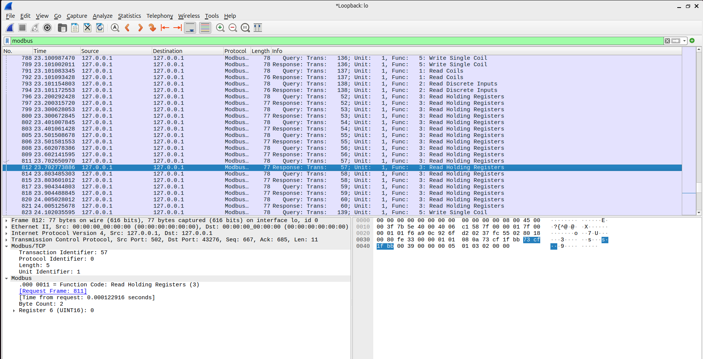
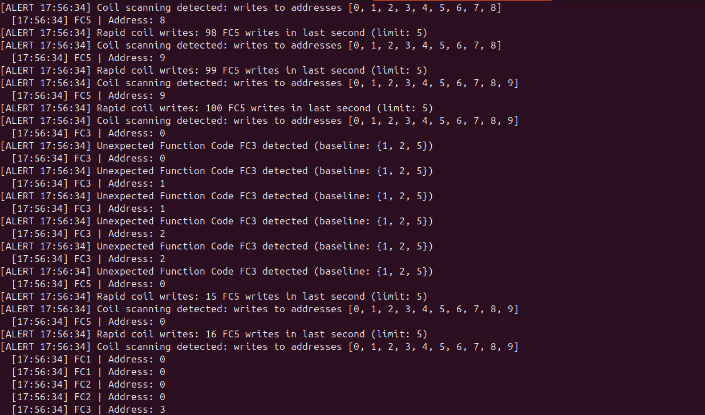

# ICS Modbus Homelab — Anomaly Detection

A hands-on ICS/OT security lab simulating a Modbus TCP environment with a software PLC, traffic generation, packet capture, and a custom Python-based anomaly detector.

---

## Lab Environment
- **PLC Runtime:** OpenPLC v3 (software PLC)
- **OS:** Ubuntu 24.04 (Parallels VM on macOS)
- **Protocol:** Modbus TCP on port 502
- **Tools:** Wireshark, Scapy, pymodbus

---

## Architecture
```
┌─────────────────┐         Modbus TCP        ┌─────────────────┐
│  Python Client  │ ────── port 502 ────────▶ │   OpenPLC v3    │
│  (attacker sim) │                           │  (software PLC) │
└─────────────────┘                           └─────────────────┘
         │                                             │
         ▼                                             ▼
┌─────────────────┐                        ┌─────────────────────┐
│ modbus_detector │                        │  webserver_program  │
│   (Scapy NIDS)  │                        │  var_out := var_in  │
└─────────────────┘                        └─────────────────────┘
```

---

## PLC Program
Simple ladder logic program running at 50ms scan cycle:
```
var_out := var_in
```
Maps to:
- **Coil 0** → var_out (writable)
- **Discrete Input 0** → var_in (readable)

---

## Files
| File | Description |
|------|-------------|
| `modbus_test.py` | Basic Modbus read/write test script |
| `modbus_loop.py` | Continuous polling to generate baseline traffic |
| `modbus_attack.py` | Simulates malicious ICS activity |
| `modbus_detector.py` | Real-time Modbus anomaly detector |

---

## Attack Simulations

### Anomaly 1 — Rapid Coil Writes
40 FC5 writes in under one second. Simulates rapid cycling of industrial equipment — technique used by Industroyer malware against Ukrainian power grid (2016).

**MITRE ATT&CK for ICS:** T0855 — Unauthorized Command Message

### Anomaly 2 — Coil Address Scanning
Sequential FC5 writes to addresses 0-9. Simulates attacker mapping controllable outputs before launching targeted attack.

**MITRE ATT&CK for ICS:** T0846 — Remote System Discovery

### Anomaly 3 — Register Enumeration
Sequential FC3 reads across holding registers. FC3 never appears in baseline traffic — any occurrence is immediately suspicious.

**MITRE ATT&CK for ICS:** T0801 — Monitor Process State

### Anomaly 4 — Dirty Disconnect
Forces coil ON then drops TCP connection without clean FIN handshake. Legitimate SCADA clients always close cleanly.

---

## Detection Logic
The anomaly detector (`modbus_detector.py`) uses Scapy to passively monitor port 502 and alerts on:

| Detection | Method | Threshold |
|-----------|--------|-----------|
| Unknown function code | Baseline comparison | Any FC not in {1, 2, 5} |
| Rapid coil writes | Sliding window rate limiter | >5 FC5 writes/second |
| Address scanning | Unique address tracking | >3 unique coil addresses written |

---

## Screenshots

### OpenPLC Dashboard — PLC Running


### Wireshark — Baseline Traffic


### Wireshark — Attack Traffic (FC3 Enumeration)


### Anomaly Detector — Live Alerts


---

## Key Findings
- Modbus TCP has zero authentication — any host on the network can send arbitrary commands to a PLC
- Normal traffic is highly predictable — FC1, FC2, FC5 only, consistent timing, single address
- Attack traffic is clearly distinguishable — anomalous function codes, high write rates, sequential address scanning
- Passive monitoring with Scapy can detect all three attack patterns in real time with no impact on PLC operation

---

## Frameworks Referenced
- [MITRE ATT&CK for ICS](https://attack.mitre.org/matrices/ics/)
- [NIST SP 800-82 Rev 3](https://csrc.nist.gov/publications/detail/sp/800-82/rev-3/final) — Guide to OT Security
- [IEC 62443](https://www.iec.ch/iec62443) — Industrial Cybersecurity Standard

---

## Next Steps
- [ ] Extend detector to log alerts to a SIEM (Wazuh/Splunk)
- [ ] Add DNP3 protocol support
- [ ] Build detection rules in Zeek
- [ ] Add PCAP export of attack traffic for evidence preservation
